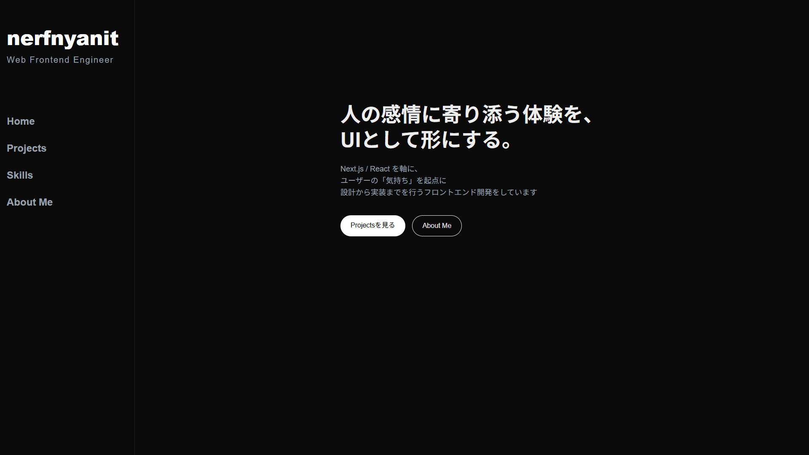

# Portfolio

フロントエンド設計と UI 実装を重視した Next.js ポートフォリオサイト

## 概要
Next.js / React を用いて制作した、個人ポートフォリオサイトです。  
UI/UX・コンポーネント設計・保守性を意識し、実務を想定した構成で実装しています。

## Screenshot

## URL
- Portfolio: https://portfolio-nerfnyanits-projects.vercel.app
- GitHub: https://github.com/nerfnyanit/portfolio

## Tech Stack
- Next.js 16 (App Router)
- React 19
- TypeScript
- Tailwind CSS 4
- Vercel

## Environment
- Node.js 20 or later

## 構成・特徴
- App Router を用いたページ設計
- 再利用性を意識したコンポーネント設計
- Custom Hook によるロジック分離
- レスポンシブ対応
- シンプルで直感的な UI

## 実装内容
- About / Skills / Projects ページ
- スキルカード表示
- カウンター・Todo などのサンプル機能
- 状態管理を含むインタラクティブな UI

## 工夫した点
- 表示とロジックを分離し、保守性・可読性を重視
- コンポーネントの責務を明確化
- 実装意図が伝わる構成を意識

## 今後の改善予定
- パフォーマンス最適化
- アニメーションの追加
- テストコードの導入
- ブログ機能の追加

## 制作目的
フロントエンド開発における  
**設計力・実装力・継続的な改善姿勢** を伝えるために制作しました。

## 作者
- GitHub: https://github.com/nerfnyanit
- X（Twitter）: https://x.com/nerfnyanit
